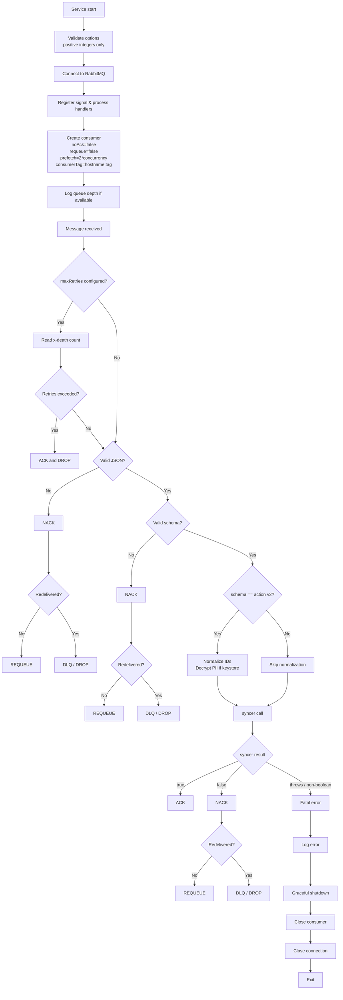

```mermaid


flowchart TD

A[Service start] --> A1[Validate options<br/>positive integers only]
A1 --> B[Connect to RabbitMQ]

B --> C[Register signal & process handlers]

C --> D[Create consumer<br/>noAck=false<br/>requeue=false<br/>prefetch=2*concurrency<br/>consumerTag=hostname.tag]

D --> E[Log queue depth if available]

E --> F[Message received]

%% retry limit guard
F --> R0{maxRetries configured?}
R0 -- Yes --> R1[Read x-death count]
R1 --> R2{Retries exceeded?}
R2 -- Yes --> R3[ACK and DROP]
R2 -- No --> G
R0 -- No --> G

%% json parsing
G{Valid JSON?}
G -- No --> G1[NACK]
G1 --> G2{Redelivered?}
G2 -- No --> G3[REQUEUE]
G2 -- Yes --> G4[DLQ / DROP]

%% schema validation
G -- Yes --> H{Valid schema?}
H -- No --> H1[NACK]
H1 --> H2{Redelivered?}
H2 -- No --> H3[REQUEUE]
H2 -- Yes --> H4[DLQ / DROP]

%% normalization
H -- Yes --> I{schema == action v2?}
I -- Yes --> J[Normalize IDs<br/>Decrypt PII if keystore]
I -- No --> K[Skip normalization]

%% business processing
J --> L[syncer call]
K --> L

L --> M{syncer result}

M -- true --> N[ACK]

M -- false --> O[NACK]
O --> O1{Redelivered?}
O1 -- No --> O2[REQUEUE]
O1 -- Yes --> O3[DLQ / DROP]

M -- throws / non-boolean --> P[Fatal error]
P --> Q[Log error]
Q --> S[Graceful shutdown]

%% shutdown
S --> T[Close consumer]
T --> U[Close connection]
U --> V[Exit]

```
