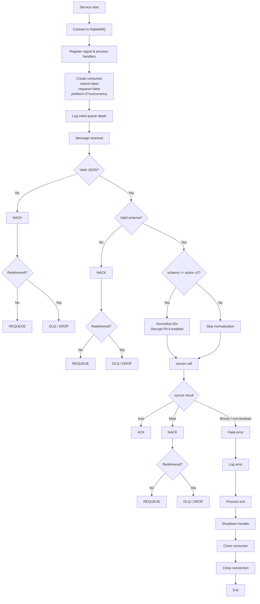

```mermaid


flowchart TD
A[Service start] --> B[Connect to RabbitMQ]
B --> C[Register signal & process handlers]
C --> D[Create consumer<br/>noAck=false<br/>requeue=false<br/>prefetch=2*concurrency]
D --> E[Log initial queue depth]

E --> F[Message received]

F --> G{Valid JSON?}
G -- No --> G1[NACK]
G1 --> G2{Redelivered?}
G2 -- No --> G3[REQUEUE]
G2 -- Yes --> G4[DLQ / DROP]

G -- Yes --> H{Valid schema?}
H -- No --> H1[NACK]
H1 --> H2{Redelivered?}
H2 -- No --> H3[REQUEUE]
H2 -- Yes --> H4[DLQ / DROP]

H -- Yes --> I{schema == action v2?}
I -- Yes --> J[Normalize IDs<br/>Decrypt PII if enabled]
I -- No --> K[Skip normalization]

L[syncer call]
J --> L
K --> L

L --> M{syncer result}
M -- true --> N[ACK]
M -- false --> O[NACK]
O --> O1{Redelivered?}
O1 -- No --> O2[REQUEUE]
O1 -- Yes --> O3[DLQ / DROP]

M -- throws / non-boolean --> P[Fatal error]
P --> Q[Log error]
Q --> R[Process exit]

R --> S[Shutdown handler]
S --> T[Close consumer]
T --> U[Close connection]
U --> V[Exit]

```
